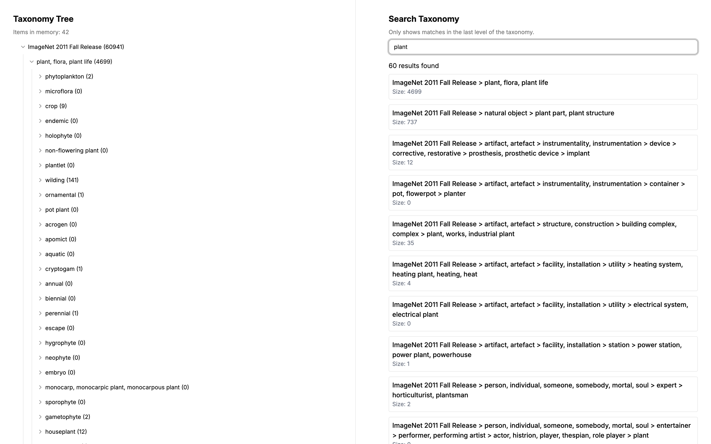

# Review Instructions

The repository contains a NestJS backend and a React (react-router framework) frontend.



## Getting Started

Run the applications using docker compose:

```bash
docker compose up -d --build
```

The frontend will be available at http://localhost:5173 and the backend at http://localhost:3000.
Make sure no other application is running on these ports.

## Ingesting Data

The backend provides an endpoint at `/ingest/url` that can be used to ingest data by url.

Run this to ingest the ImageNet data:

```bash
curl -X POST http://localhost:3000/ingest/url -H "Content-Type: application/json" -d '{"url": "https://raw.githubusercontent.com/tzutalin/ImageNet_Utils/refs/heads/master/detection_eval_tools/structure_released.xml"}'
```

## Get Taxonomy by Level (optional)

The backend provides an endpoint at `/path?query=<path>` that can be used to get taxonomy 1 level at a time at path.

```bash
curl "http://localhost:3000/path?query=ImageNet%202011%20Fall%20Release"
```

This will return an array of taxonomy elements at the path `ImageNet 2011 Fall Release`.

## Get Tree by Depth (optional)

Although not used by the frontend, the backend provides an endpoint at `/tree?depth=<depth>` that can be used to get taxonomy tree by depth. This is implemented as part of the assignment request.

```bash
curl "http://localhost:3000/tree?depth=1"
```

This will return json of the tree of depth.

You can also use `depth=-1` to get all elements.

The Big O complexity of this endpoint is O(n _ d _ b), where:

- n is the number of taxonomy elements (when iterating over all elements).
- d is the depth of the tree (when iterating over parts).
- b is the branching factor of the tree (when looking up children).

## Frontend

The frontend app is available at [http://localhost:5173](http://localhost:5173).

### Taxonomy Tree

This renders a tree of taxonomy, lazily loading children on demand.
Fun fact: I'm using my own tree view component for this: [MrLightful/shadcn-tree-view](https://github.com/MrLightful/shadcn-tree-view).

### Taxonomy Search

This renders a search bar that allows you to search for taxonomy elements.
Only shows matches in the last level of the taxonomy.

# Notes

Technical:

- Both backend and frontend are Typescript.
- Nestjs backend.
- Drizzle ORM.
- SQLite database.
- React (react-router framework) frontend.
- TailwindCSS + Shadcn UI.
- Dockerized for easy review.

What's good:

- The tree view is lazy loading children on demand.
- The search bar is debounced to prevent too many requests.
- The search bar only shows matches in the last level of the taxonomy.
- Ingestion is batched, so not to overload the database.
- Ingestion is done async, so http response is immediate & not timing out.

What's bad:

- UI/UX is minimal to just serve the purpose.
- Lazy loading of children is a bit janky, could be rendered nicer (e.g. with a loading spinner).
- The frontend app is using simple state hooks (more production-ready app would be using context-provided state and zustand/redux/other state management library).
- Duplication of data is not handled properly (e.g. if you ingest the same url multiple times).
- Proper error handling is not implemented.
- Tree building Big O could be improved (e.g. branching factor to O(1) by creating a lookup map).
- Search result pagination is not implemented.
- Tree view not perfomant if 1 level contains too many elements; lazy loading within 1 level might be needed.
